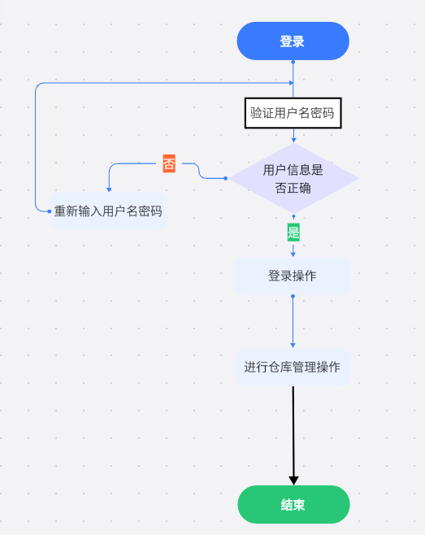
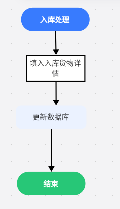
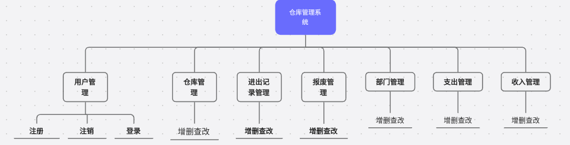

# 仓库管理系统开发文档

## 需求分析与建模

企业目前存在的问题是：信息化不足，计算机使用率低，大量的日常工作皆是手工处理，纸面处理。因此工作效率低落，企业内部沟通不及时等等问题很难克服，仓库管理不合理，不能及时根据需要调整库存，不能根据快速的调整库存。

企业希望解决的问题是：

1. 设计一个企业管理信息系统，解决各个业务部门之间缺少信息沟通（即重复劳动）和共享，这两个导致传统仓库管理中占用资源过大的主要问题。
2. 解决企业内部统一的物料编码管理，物流管理中的信息流通。库存积压与物料的配套问题。
3. 完善质量检验，对生产过程中的质量信息进行全面管理，用户反馈，售后服务，并对各种数据进行统计分析。
4. 销售部门能方便地根据预测信息、各仓库的库存信息和客户的要货情况做出货物的调拨计划和改制计划。
5. 随时了解供应商的供货（原材料和添加剂）执行情况、精炼车间的加工（合格、报废、返工等）执行情况及公司的各仓库库存情况，以便随时协调或采取合适的补救措施管理供应商，在供应到货的到期日前，主动与供应商联系，检查及时到货的可能性；对供应商的考核从质量、交货及时程度和价格上给出统计数据。计划过程不太理想，无物料清单，凭经验办事；对计划的执行率未作统计。现有量、在制品、再途库存和历史记录等多方位查询需求。
6. 库存信息与供应和生产等各部门的及时反馈和共享问题信息查询与决策，对集团公司的各种资源与信息进行查询，包括销售、采购、生产、质量、人事、财务等信息数据进行查询、统计与分析，对根据信息作出快速合理的经营决策，增强应变反应能力。

### 设计目标

本仓库管理软件的目标主要向中小型物流仓储企业开发的仓库管理软件， 仓库能够接受一家客户的委托管理他们的货物存储。能够对仓库内的货物收、发、存、调、查等操作进行全面的监测、控制和管理。 输出报表，及时反映出货物占用状况、收发与物资的仓储、流向情况，为生产管理和成本核算提供依据，使用户能够实现高效管理。

### 功能需求

本系统主要需求有：基础数据维护，货物入库，货物出库，货物费用计算，货物数量计算，输出统计报表、查询进出货记录、查询货物余量、分类等。

提供一套完备的与企业仓库管理中所需相一致的功能：

（1）建立基本资料信息库，规范所有资料信息。

（3）高仓库管理的服务水平，最大限度地降低库存量，以减少在库存上的资金积压。

（4）最大限度的保证订货任务的按期完成。

（5）提高计划的可能性，实现均衡生产：

（6）集成管理职能，提高管理效率。

系统整体可以分为多个子系统，分别对应某些特定方面的功能。从整体上看，整个系统可以分为8个子系统：

（1）登录管理：包括权限管理，帐户管理，帐户认证，角色分配。

（2）仓库管理：包括库存明细，查询，出入库，盘点，调拨。

（3）进出库记录管理：生成进出库记录，包括报废出库，方便查询货物来源去向。

（4）智能库存分析及报警管理：包括决策生成。

（5）报表管理，生成各种用户所需求的表，方便查看

#### 功能划分

用户管理、仓库管理、进出记录管理、报表管理、报废管理、部门管理

隐形表，为其他功能服务

用户信息修改记录表

##### 用户管理：

用户管理模块能方便对已有的用户进行管理，超级管理员可以进行增、删、改、查的基本操作，管理员可以查看仓库的库存情况，并且进行增删查改，普通用户可以进行查看操作，游客无法查看该公司库存。库存表的基本属性有货物的信息：商品编号、名称、分类、价格、库存数量、上次入库时间、上次出库时间等。

###### 用户显示（超级管理员功能）

超级管理员可以查看所有用户（包括游客）并且赋予这些用户不同的权能（两种方式，第一种赋予部分权能但并不改变用户身份，第二种改变用户身份）超级管理员可以赋予别人超级管理员权限

仓库管理员可以赋予游客用户的身份，但不可以赋予别人仓库管理员身份

###### 用户注册

使用手机号注册，方便进行管理，用户信息有员工编号、姓名、性别、出生日期、部门、联系电话、住址等。且可以修改头像。（建议为该职员的正式照）

###### 用户修改

员工可以修改自己的姓名、性别、出生日期、联系电话、住址等信息。

管理员可修改所有员工信息

###### 用户删除

员工可以选择注销自己的账户，超级管理员可以注销员工的账户。

##### 仓库管理

###### 入库管理（超级管理员、仓库管理员）

对货物进行入库操作，包括入库时间、商品编号、入库数量、单价、总价、供应商、经办人

###### 出库管理（超级管理员、仓库管理员）

对货物进行出库操作，包括出库时间、商品编号、出库数量、单价、总价、供应商、经办人

###### 查看库存（除游客外所有人）

查看所有商品库存

###### 查看某一商品库存（查询（支持模糊查询））

查看查询商品库存

###### 修改库存（超级管理员、仓库管理员）

修改商品信息，包括上次入库时间，上次出库时间、商品编号、数量、单价等

###### 批量删除（超级管理员）

批量删除商品信息（勾选）

###### 单独删除（超级管理员、仓库管理员）

###### 增加商品信息（无需填写供应商（超级管理员））

增加已有商品信息，无需填写供货商

###### 库存预警（仓库管理员及以上）

###### 数据导出（勾选（提供全选功能）仓库管理员及以上）

##### 进出记录管理

###### 查看所有进出记录（除游客所有人）

查看入库时间、商品编号、入库数量、单价、总价、供应商、经办人

查看出库时间、商品编号、出库数量、单价、总价、供应商、经办人

###### 查看某条进出记录（除游客所有人）

根据商品编号，名称，操作时间或者操作类型（出入库）查询

###### 修改进出记录（超级管理员）

修改入（出）库时间、商品编号、入（出）库数量、单价、总价、供应商、经办人

###### 删除进出记录（超级管理员）

单独删除某条记录，或勾选批量删除

###### 数据导出（勾选（提供全选功能）仓库管理员及以上）

##### 报废管理

###### 报废货物增加（仓库管理员以上）

时间 经办人 原因 货物编码 数量 单价 总价 供货商 入库时间

###### 修改（超级管理员）

时间 经办人 原因 货物编码 数量 单价 总价（自己算的不需要修改但是要有显示） 供货商 入库时间

###### 修改（仓库管理员）

原因 数量 单价 

###### 单一删除（超级管理员，仓库管理员）

###### 批量删除（超级管理员）

###### 查看所有（游客以上）

###### 查询（游客以上（模糊查询））

##### 部门管理（超级管理员）

###### 增加部门

部门编号，部门名称

###### 修改部门

###### 删除部门

###### 查看部门

##### 支出

支出时间 用途 支出金额

增删查改（系统管理员，仓库管理员）

##### 收入

收入时间 收入金额 收入来源

增删查改（系统管理员，仓库管理员）

### 性能需求

#### 安全性

1.系统要求数据存储安全，保证用户信息的保密性和数据完整性。

2.系统应该具有防范黑客攻击的能力，防止数据泄露和恶意攻击。

#### 可靠性

1、系统应该具有高可靠性，确保数据能够长期稳定存储。

2、系统应该具有自动备份和恢复功能，以防止数据丢失。

#### 可维护性

1、系统应该具有良好的可维护性，使得管理员能够方便的进行系统维护。

#### 可扩展性

1.系统应该具有良好的可扩展性，以方便管理员在需求变化时进行系统的扩展和修改。

#### 可用性

1、系统应该具有良好的用户体验，使得管理员能够方便的进行各类操作和查询。

2、系统应该就有良好的界面设计和交互设计，使得管理员能够快速上手并进行操作。

#### 时间特性

1、要求数据库更新及时，保证后续读取数据方便快捷

#### 数据精确度

1、系统应该及时更新数据且做好数据上锁等操作，避免数据的脏读等。

#### 运行需求

##### 用户界面

web端：页面布局清晰，颜色搭配合理，色调柔和，各页面主题风格一致且符合企业文化。

##### 软件接口

1、短信继承接口 发送验证码等用户注册 验证码登录 密码找回等功能。

##### 故障处理

及时做好备份，发生故障时及时报警，并通知相关人员进行突发情况的处理和软件的维护。

1. 入库表：记录商品的入库信息，包括入库时间、商品编号、入库数量、单价、总价、供应商、经办人等。
2. 出库表：记录商品的出库信息，包括出库时间、商品编号、出库数量、单价、总价、客户、经办人等。
3. 库存表：记录每种商品的当前库存数量、上次入库时间、上次出库时间、商品编号、数量、单价等信息。
4. 员工表：记录员工的信息，包括员工编号、姓名、职位、联系电话、住址等。
5. 支出表：记录仓库的支出信息，包括支出时间、支出金额、支出用途等。
6. 收入表：记录仓库的收入信息，包括收入时间、收入金额、收入来源等。

## 详细设计

### E-R图如下

### 数据库设计如下

#### CDM 概念数据模型

#### LDM  逻辑数据模型

#### PDM 物理数据模型

最终导出sql文件

### 数据库表

#### 货物表

#### 小类

#### 大类

#### 部门

#### 支出

#### 收入

#### 仓库

#### 入库

#### 出库

#### 报废

#### 计量单位

#### 用户

## 界面设计

### 登录界面

就按照这个界面设计

### 管理界面

#####  UI设计

##### 主页界面设计

##### 出入库等界面设计

##### 具体

###### 	上导航栏

​		logo和用户

###### 	左导航栏

​		首页

​		仓库管理

​			仓库信息

​			入库管理

​			出库管理

​		进出记录

​		报废管理

​		部门管理

​		用户管理

###### 	内容栏

​		首页:

​			销售总额,入库数量,出库数量

​			公告

​			统计图